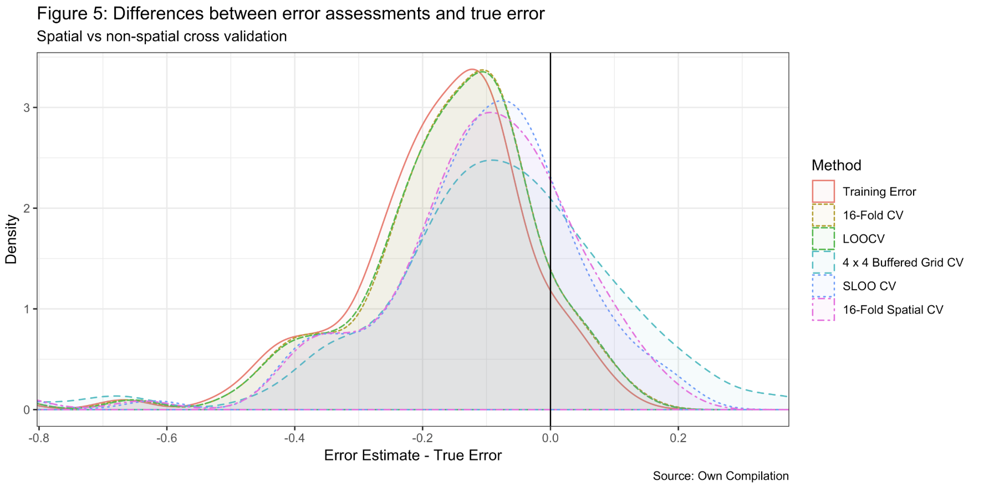
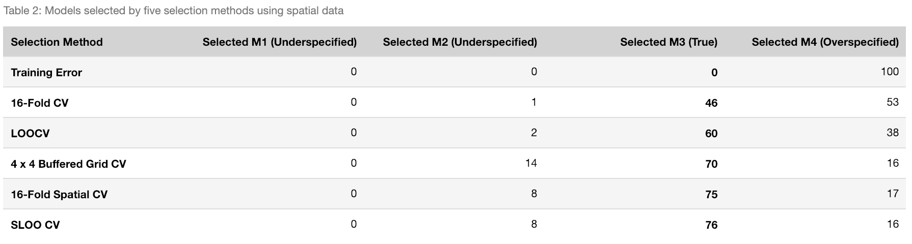

# Spatial Cross-Validation

**Description:**
- Cross-validation is a popular computational method used for model assessment and selection. However, with spatial data, many of the independence assumptions behind cross validation break down (due to spatial autocorrelation (SAC)). Therefore, this analysis will conduct an in-depth study of cross-validation methods for model assessment and selection on spatial data. 

**Results:** 

  

  

**Conclusion**
Spatial data presents unique challenges for cross-validation model assessment and selection. In this notebook, we explore these challenges and study potential solutions using different techniques and multiple simulations. The simulations show
that spatial CV methods do indeed outperform non-spatial CV methods at both *assessment* and *selection* on spatial data. More specifically, the results highlight that spatial CV methods tend to be less over-optimistic about model performance and are also better at selecting the true model instead of an overspecified one. 
